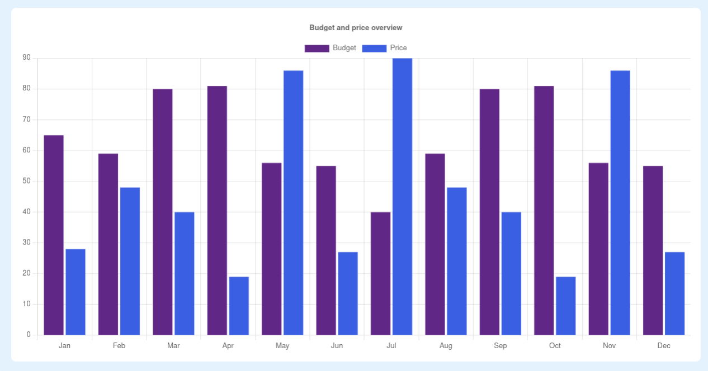

# Components

In the components folder you will find all the components that are used in the project. The components are all split into their own folders, where you will find helpers, styles and the component itself.

## Table of contents

- [Barchart](#barchart)
- [ButtonDialog](#buttondialog)
- [Card](#card)
- [DetailPanel](#detailpanel)
- [MiniCard](#minicard)
- [Navbar](#navbar)
- [Navigation](#navigation)
- [View components with storybook](#view-components-with-storybook)

## Barchart

The bar chart component is used by our application to display the budget and actual shopping list price for the past year. Find screenshot below:



We use [chart.js](https://www.chartjs.org/) to create the bar chart. 

## ButtonDialog

The button dialog component is used by our application to display a dialog box with buttons. Find screenshot below:


We use [shoelace](https://shoelace.style/) to create the dialog box and buttons.

### Props

```javascript
interface ButtonDialogProps {
    open: boolean;
    onClose: () => void;
    title: string;
    buttonValues: ButtonProps[];
    text?: string;
}

export interface ButtonProps {
    text: string;
    variant: "text" | "default" | "danger" | "primary" | "success" | "neutral" | "warning";
    onClick: () => void;
}
```

## Card

The card component is used by our application to display a card with a title and content. Find screenshot below:


We use [shoelace](https://shoelace.style/) icons for the card.

### Props

```javascript
interface CardProps {
    backgroundColor: string;
    iconBackgroundColor: string;
    mainText: string;
    iconName?: string;
    subText?: string;
    height?: string;
    directLink?: string;
    onClick?: () => void;
}
```

## DetailPanel

The detail panel component is used by our application to display a panel with recent shopping list items. Find screenshot below:


## MiniCard

The mini card component is used by our application to display a mini card with a title and content. Find screenshot below:


We use [shoelace](https://shoelace.style/) icons for the mini card.

### Props

```javascript
interface MiniCardProps {
    backgroundColor: string;
    iconBackgroundColor: string;
    mainText: string;
    subText?: string;
    textColor?: string;
    iconName?: string;
    directLink?: string;
}
```

## Navbar

The navbar component is used by our application to display a navigation bar. Find screenshot below:


## Navigation

This is a hidden component that is used by our application to manage routing.

## View components with storybook

To view the components with storybook, run the following command:

```bash
npm run storybook
```

Make sure to run the following command before running storybook:

```bash
npm install
```
