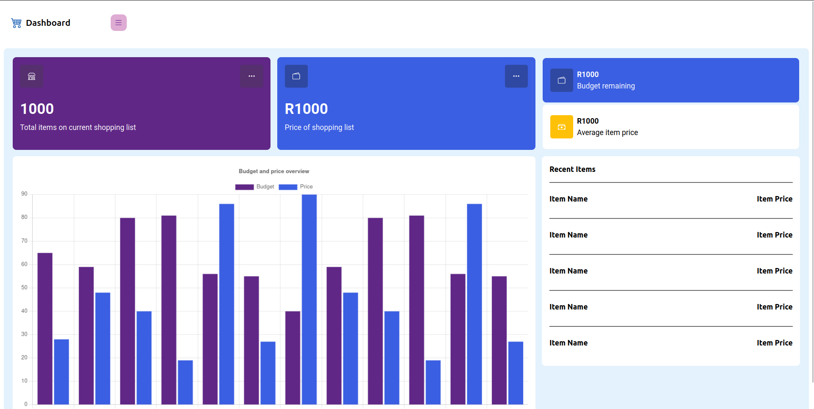

# Pages

## Dashboard page

The dashboard page is the main page of the application. It displays a dashboard with all the information about the users shopping lists. Find screenshot below:

The dashboard page is built using the components from the components folder and there is currently no sections of the page that is not a component. We use Material UI for the Grid system on the page, read more about [Material UI](https://material-ui.com/).

Something to note is that the page scss file is stored in the styles folder.